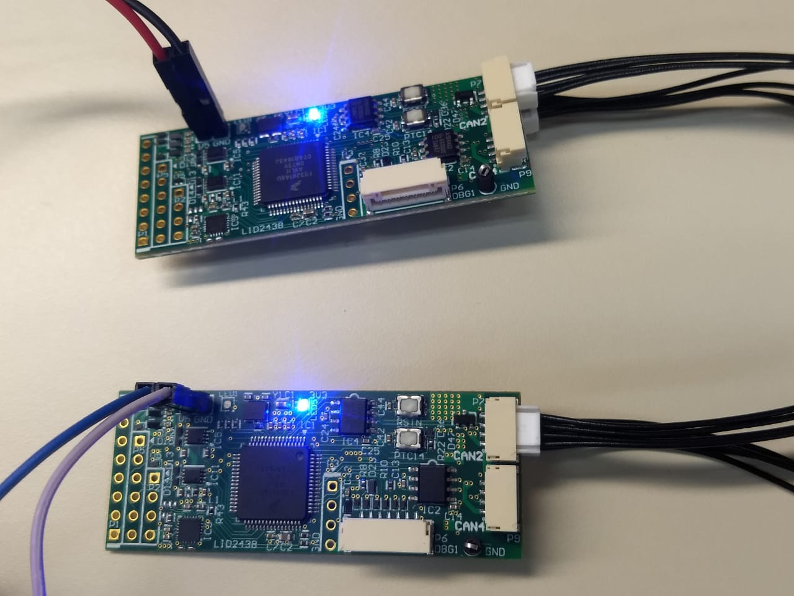

# libuavcanV1 demo on NXP UAVCAN node board
### Instructions:

Interconnect 2 UAVCAN board nodes (UCANS32K146) with a single JST-GH cable between both board's CAN2 plugs, and the connectors with the 120 ohm terminal.

1. Open S32 Design Sudio.
2. Click File -> Import
3. Under the Git tab, select "Projects from Git" and next.
4. Click "Clone URL" and next.
5. Paste the URL of this repository and click next. https://github.com/noxuz/libuavcan_demo
6. Click the master branch and next.
7. Click "Browse" for the desired destination directory of the project and click next.
8. Choose "Import existing Eclipse projects" and click next and then "Finish".
9. Click the down arrow at the right of the Hammer Icon in the toolbar and select a desired build for NODE_A or NODE_B.
10. Click the yellow ligthning shaped icon in the toolbar for flashing the project into the board.
11. In the list loacted at the left of the popped windowd and choose the same of profile previosuly built "libuavcanV1_demo_Debug NODE_A" for example and click flash with the board connected to the Jlink debugger and to 5V power.
12. Repeat steps 9-11 for the other board but with the desired build configuration NODE_A or NODE_B swapped.
13. A green led close to the 5V headers should blink approx each second, read description in top of src/main.cpp, if the green LED from both boards is still, try pressing the reset button in the board that got the NODE_A program flashed into, which is the one that starts the transmission.
14. With an oscilloscope view the frames being transmited at 4Mbit/s data phase and 1Mbit/s in nominal phase.

