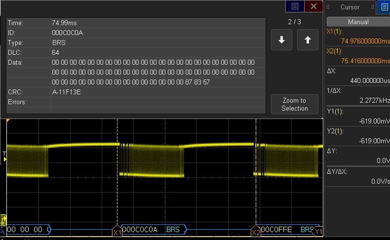

# libuavcanV1 demo on NXP UAVCAN node board
Instructions:

Interconnect 2 UAVCAN board nodes with a single connector.
Modify src/main.cpp line 28 with NODE_A or NODE_B for building for each board, NODE_A transmits first.

1. Open S32 Design Sudio.
2. Click File -> Import
3. Under the Git tab, select "Projects from Git"
4. Click "Clone URL" and next.
5. Paste the .git URL of this repository and click next. https://github.com/noxuz/libuavcanV1_board_DEMO.git
6. Click the master branch and next.
7. Browse for a destination directory and click next.
8. Choose "Import as general project" and click next.
9. If "A .project file already exists" is mentioned, delete the .project file generated in the destination folder and Click Finish
10. Click in the Hammer Icon in the toolbar for building the project.
11. Click the ligthning icon in the toolbar for flashing into the board.
12. In the list at the left choose "project_name"_Debug_Segger and click flash with the board connected to the Jlink debugger and power.
13. Repeat steps 10-13 for the other board but with the macro NODE_A or NODE_B swapped.
14. A green led close to the 5V headers should blink approx each second, read description in top of src/main.cpp
15. With an oscilloscope view the frames being transmited at 4Mbit/s data phase and 1Mbit/s in nominal phase.

